# Gapminder Data Analysis

An end-to-end R project that processes the Gapminder dataset (1952–2007) to examine global patterns in life expectancy, GDP per capita, and population. The workflow generates 12 visualizations, fits a regression model, and creates a polished HTML report.

## Table of Contents

1. [Project Overview](#project-overview)  
2. [Features & Charts](#features--charts)  
3. [Prerequisites](#prerequisites)  
4. [Installation](#installation)  
5. [Usage](#usage)  
6. [File Structure](#file-structure)  
7. [Scripts & Automation](#scripts--automation)  
8. [Docker & Containerization](#docker--containerization)  
9. [Extending & Customizing](#extending--customizing)  
10. [Data Source & Citations](#data-source--citations)  
11. [License](#license)  

---

## Project Overview

This repository includes everything necessary to:

- **Download** and prepare the Gapminder data using the `gapminder` package in R.  
- **Calculate** key statistics such as global averages and country-level snapshots.  
- **Create** 12 charts that highlight trends over time, economic associations, continental comparisons, and demographic impacts.  
- **Fit** a regression model linking life expectancy to GDP per capita.  
- **Automate** the process with shell scripts, a Makefile, and Docker.  
- **Produce** a well-formatted RMarkdown report (`Gapminder_report.html`).  

Perfect for anyone interested in learning or teaching global development analysis, from students to data scientists.

---

## Features & Charts

1. **Global Average Life Expectancy Over Time**  
2. **Global Average GDP per Capita Over Time**  
3. **Global Total Population Over Time**  
4. **Scatter: Life Expectancy vs. GDP per Capita (2007)**  
5. **Regression: Life Expectancy ~ log(GDP per Capita)**  
6. **Top 10 Countries by Life Expectancy (2007)**  
7. **Boxplot: Life Expectancy by Continent (2007)**  
8. **Violin: GDP per Capita by Continent (2007)**  
9. **Line: Average Life Expectancy by Continent Over Time**  
10. **Density: Life Expectancy Distribution by Continent (2007)**  
11. **Heatmap: Average Life Expectancy by Year & Continent**  
12. **Bubble Plot: GDP vs. Life Expectancy Sized by Population (2007)**  

Each chart is saved as `gap-<index>.png` and displayed in the R session.

<p align="center">
  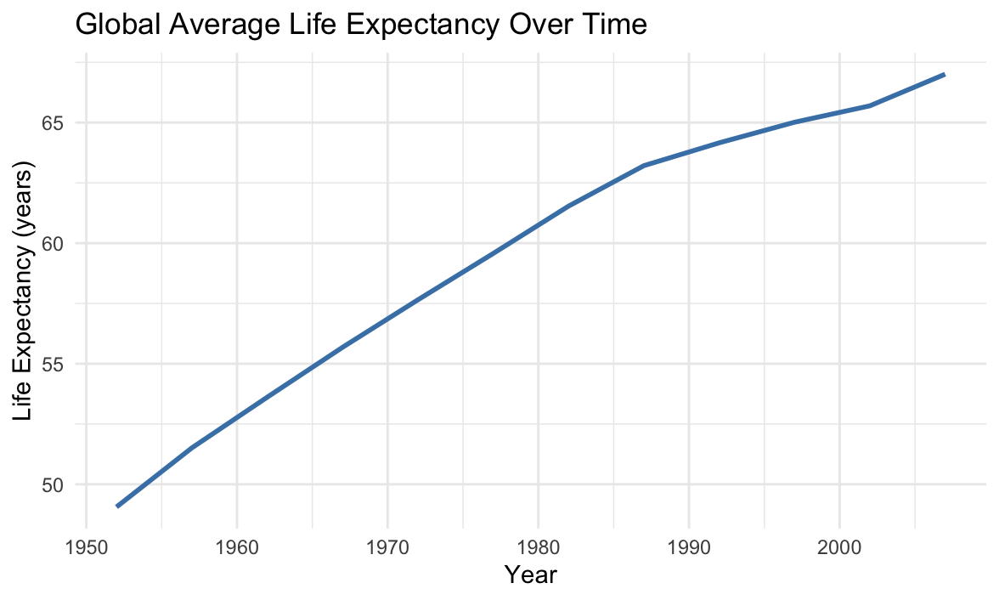
</p>

<p align="center">
  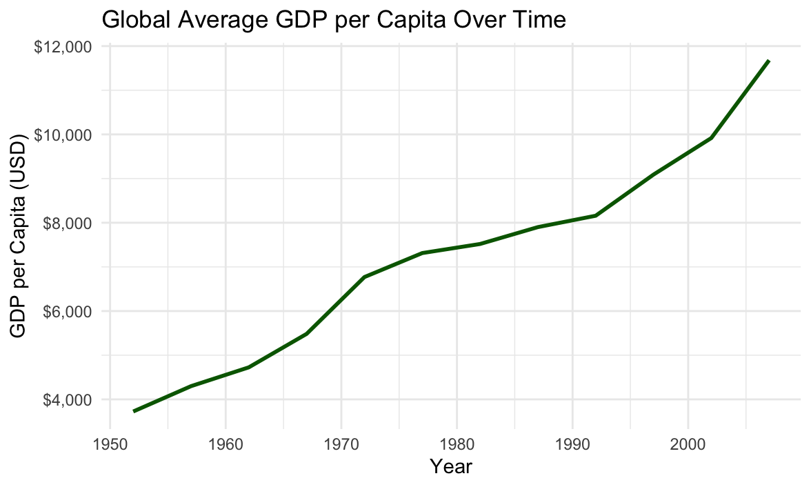
</p>

<p align="center">
  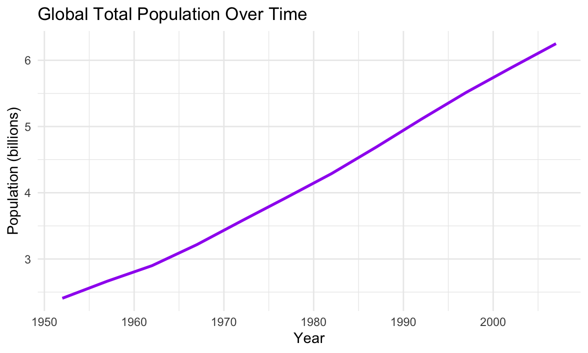
</p>

<p align="center">
  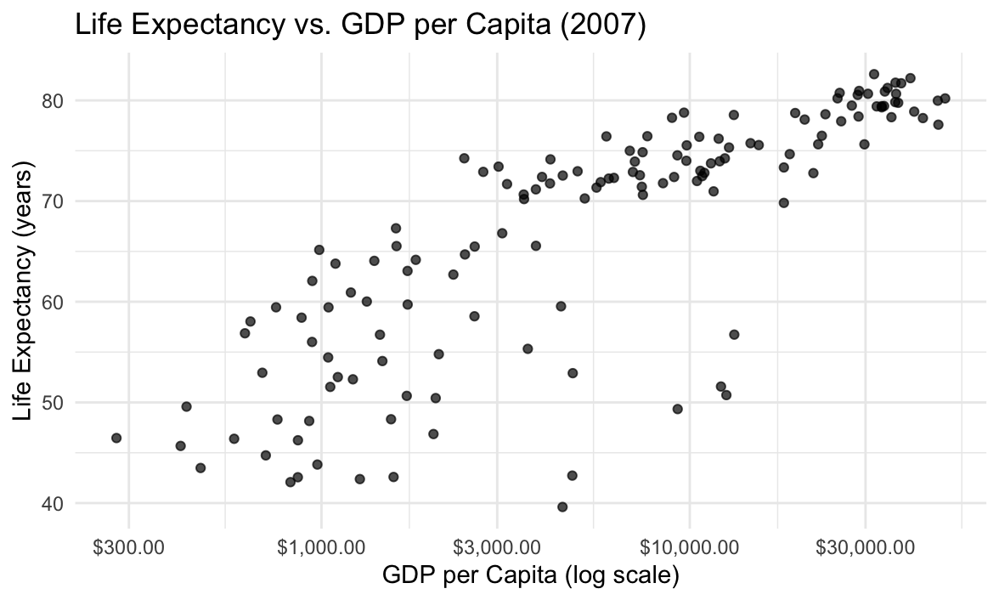
</p>

<p align="center">
  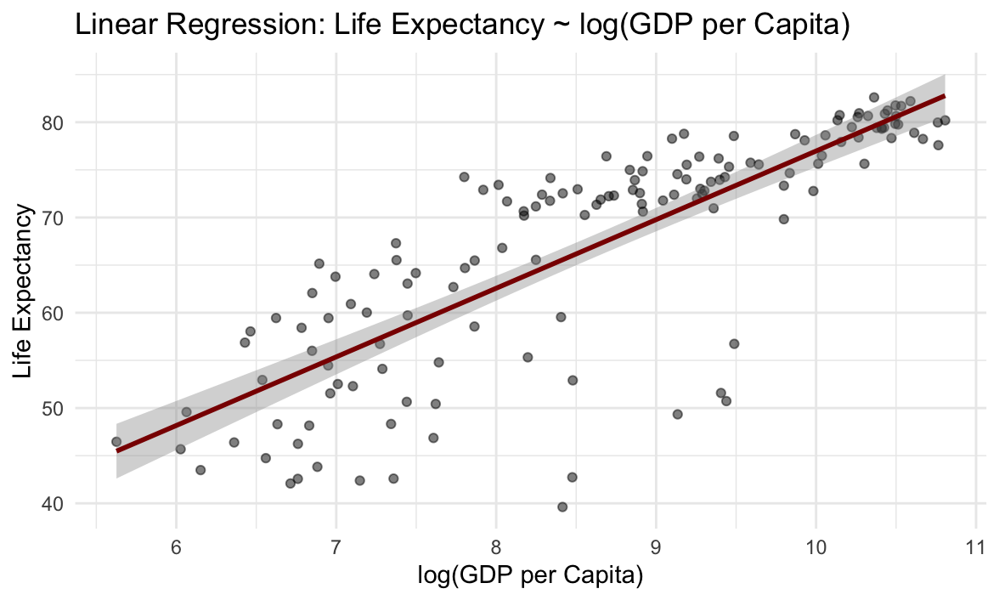
</p>

<p align="center">
  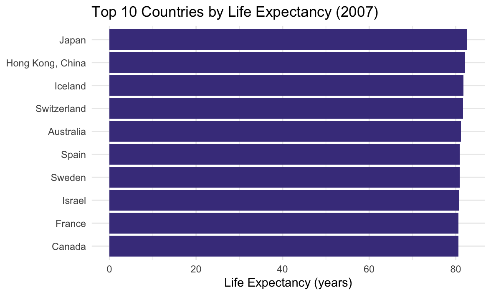
</p>

<p align="center">
  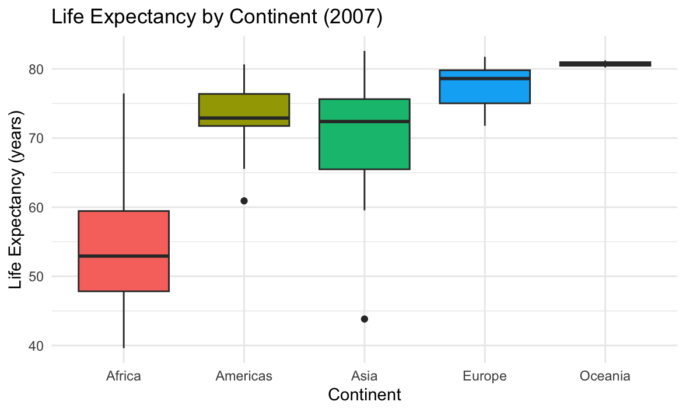
</p>

<p align="center">
  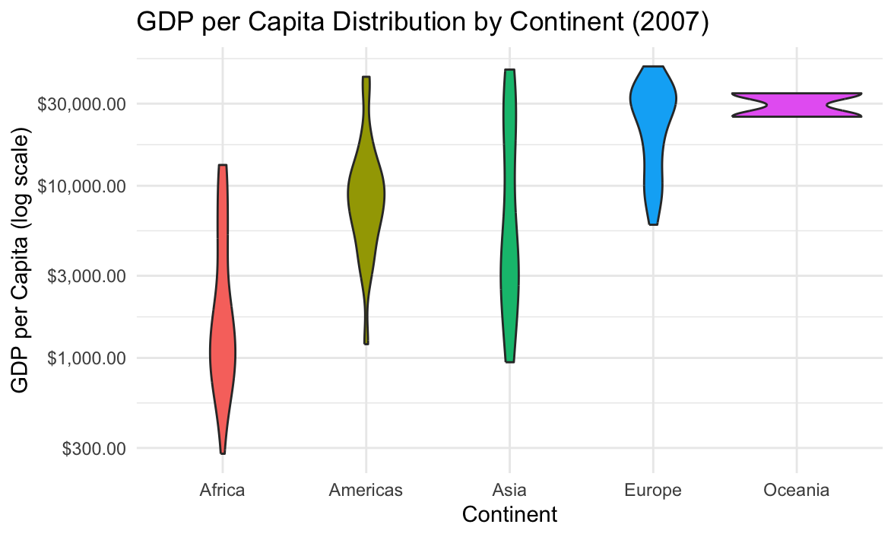
</p>

<p align="center">
  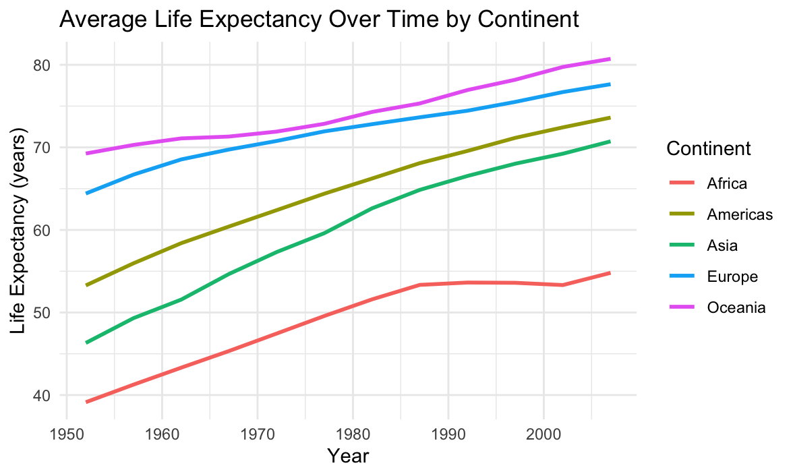
</p>

<p align="center">
  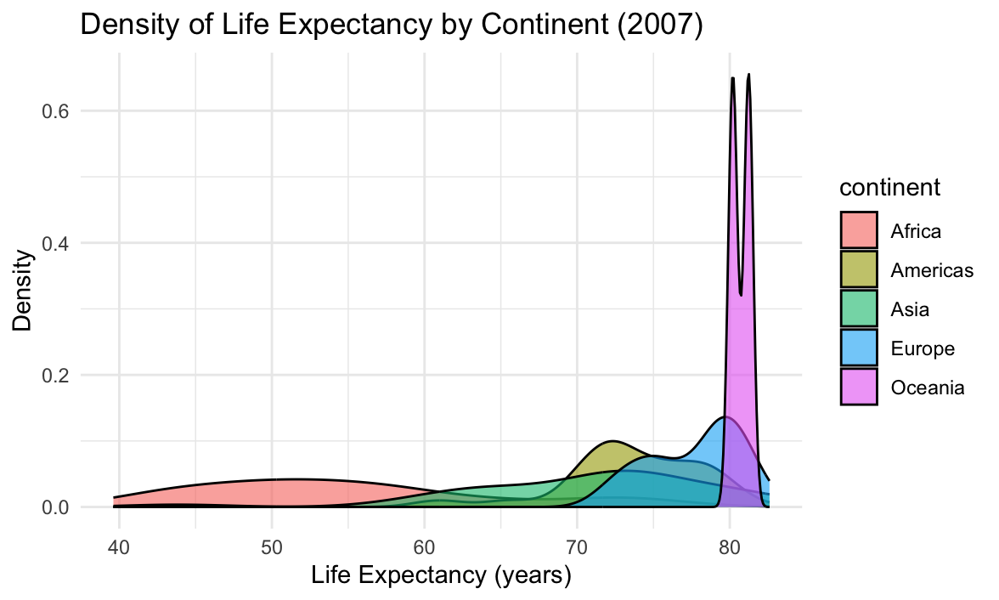
</p>

<p align="center">
  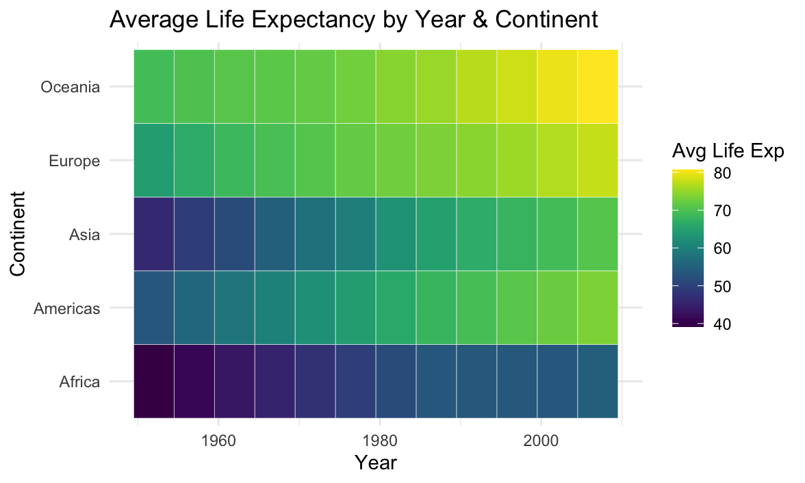
</p>

<p align="center">
  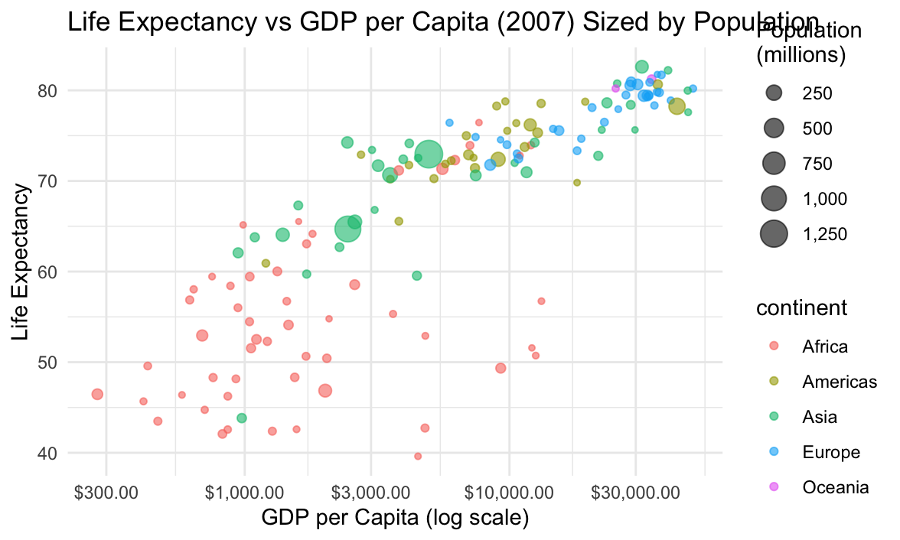
</p>

---

## Prerequisites

- **R** version 4.0 or higher  
- **RStudio** (recommended for development)  
- Internet access for installing packages and downloading data  

### Required R Packages

- `ggplot2`  
- `dplyr`  
- `gapminder`  
- `scales`  
- `viridis`  
- `tidyr`  
- `forcats`  
- `zoo`  
- `rmarkdown`  

The main script will install any missing libraries automatically.

---

## Installation

1. **Clone** the repository:

   ```bash
   git clone https://github.com/yourusername/gapminder-analysis.git
   cd gapminder-analysis
   ```

2. **Install** R if needed.  
3. **(Optional)** Copy `.env.example` to `.env` to set environment variables.

---

## Usage

### Generate Plots

```bash
bash scripts/run_gapminder.sh
```

This command runs the analysis and saves all 12 plots as `gap-1.png`…`gap-12.png`.

### Build the HTML Report

```bash
bash scripts/render_report.sh
```

Generates `Gapminder_report.html`.

### All-in-One via Make

```bash
make report
```

Runs both the plotting and report generation steps.

---

## File Structure

```
.
├── Gapminder_Analysis.R       # Core analysis script
├── Gapminder_Analysis.Rmd     # RMarkdown report
├── Gapminder_report.html      # Output HTML report
├── gap-*.png                  # Saved chart images
├── scripts/
│   ├── run_gapminder.sh       # Script to execute the analysis
│   └── render_report.sh       # Script to render the report
├── Makefile                   # Automation commands
├── Dockerfile                 # Defines container setup
├── docker-compose.yml         # Orchestrates container build/run
├── .env.example               # Sample environment file
└── README.md                  # This document
```

---

## Scripts & Automation

- **`scripts/run_gapminder.sh`**  
  Executes `Gapminder_Analysis.R` and saves the plots.

- **`scripts/render_report.sh`**  
  Converts `Gapminder_Analysis.Rmd` into `Gapminder_report.html`.

- **`Makefile`**  
  - `make analysis` — Run the analysis script  
  - `make report` — Generate plots and render report  
  - `make clean` — Remove generated images and report  

---

## Docker & Containerization

To run everything in Docker:

```bash
docker-compose up --build
```

This setup will:

1. Install system and R dependencies  
2. Execute the analysis script  
3. Render the RMarkdown report  

All results are shared via a bind mount.

---

## Extending & Customizing

- **Add new charts**: Add more code chunks to `Gapminder_Analysis.R` or the RMarkdown file.  
- **Parameterize**: Pass arguments or use a YAML header to filter by year or continent.  
- **CI/CD**: Use GitHub Actions to automatically rebuild the report on each push.  
- **Swap data**: Replace the Gapminder source with another tidy dataset for similar analysis.

---

## Data Source & Citations

- **Gapminder** data accessed via:

  ```r
  install.packages("gapminder")
  ```
- Additional R packages available on CRAN.

---

## License

This project is released under the **MIT License**. See [LICENSE](LICENSE) for more details.
